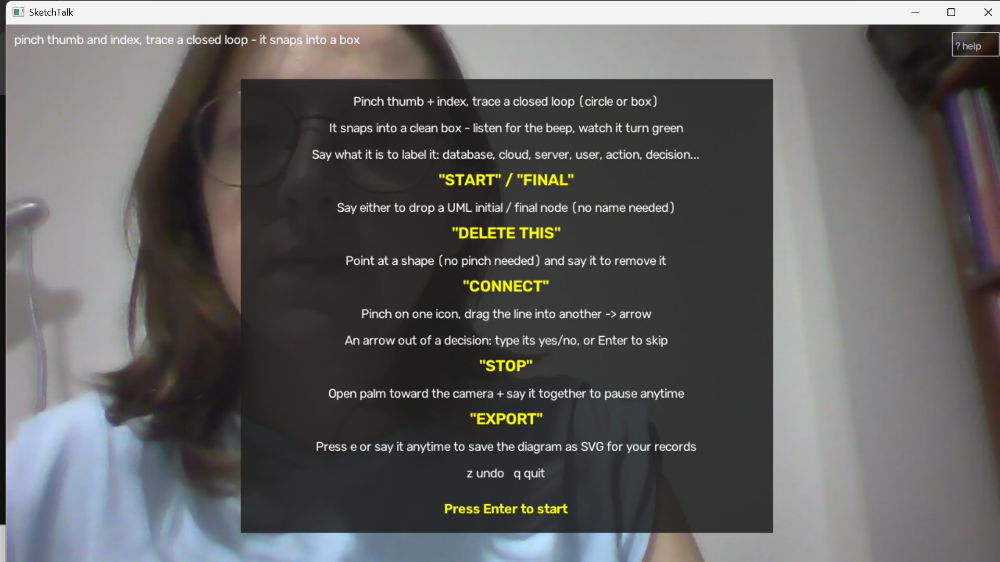
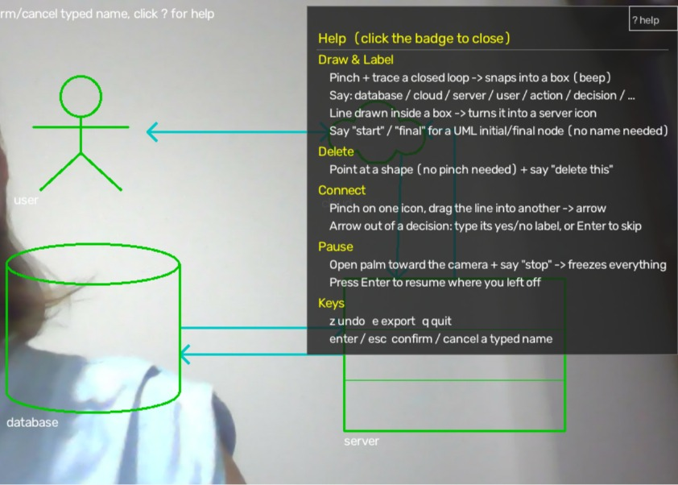
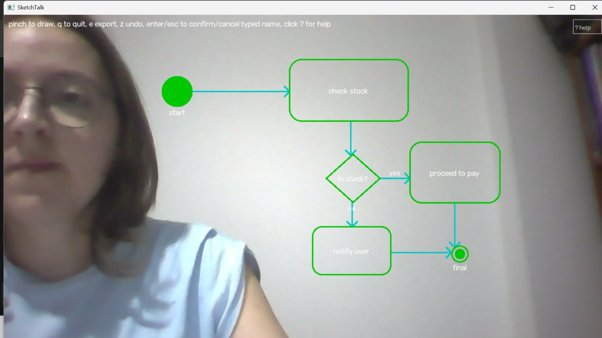
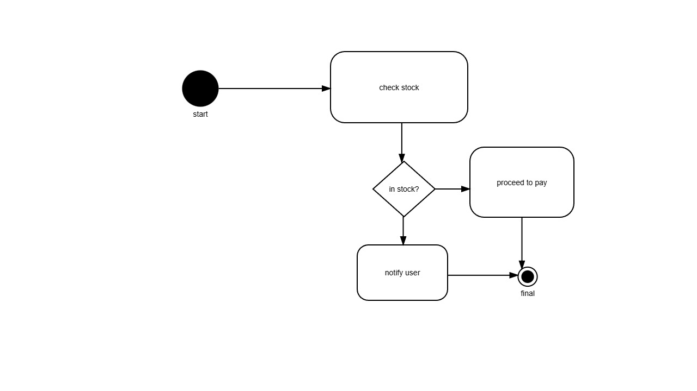
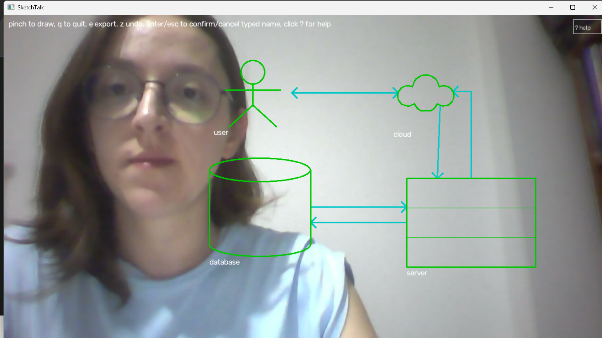
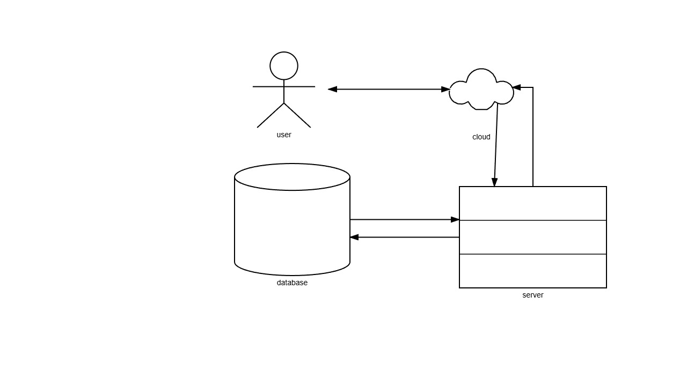
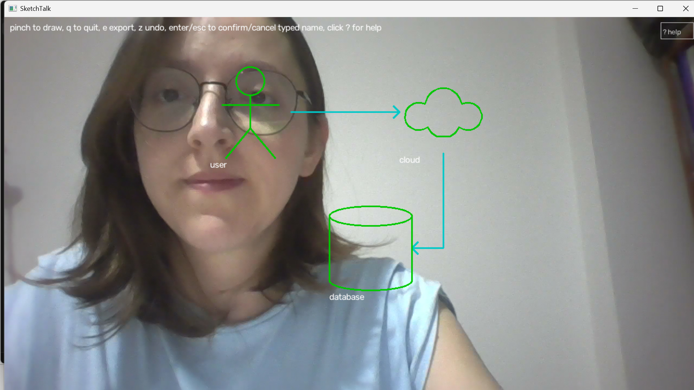
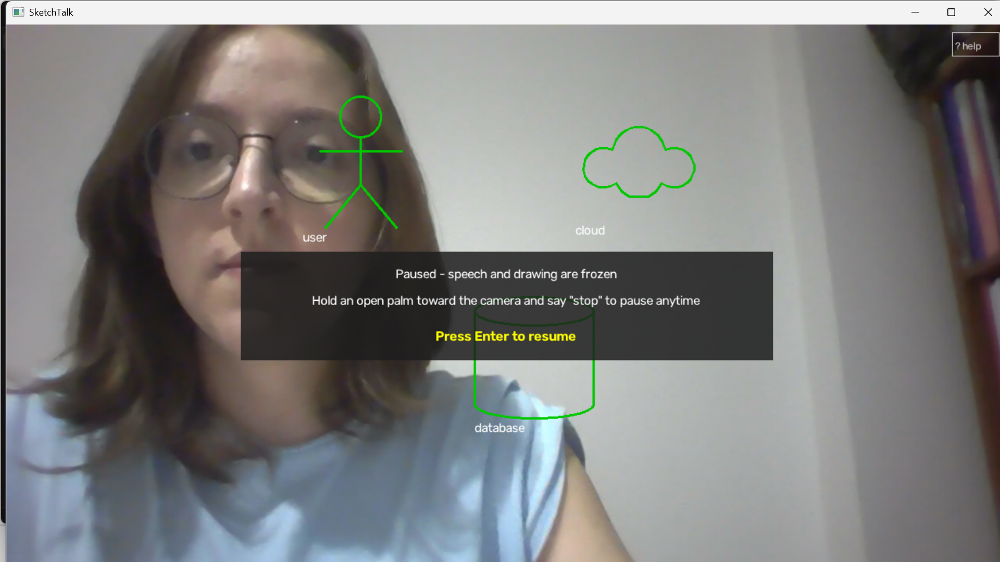
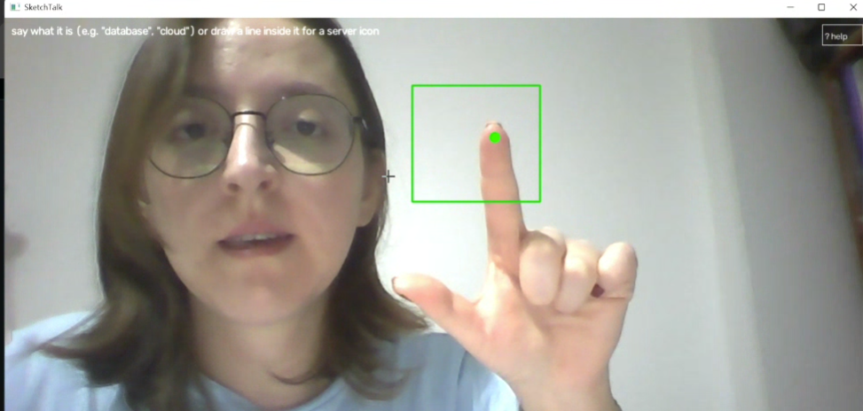
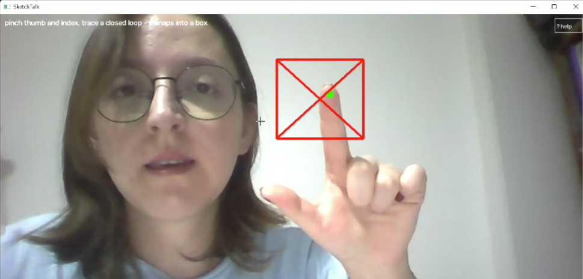

# SketchTalk

Multimodal architecture diagramming with air gestures and speech — sketch
boxes, connectors, and UML-style icons on a live webcam feed without
touching anything.

Built for the Multimodal Interaction course at Sapienza University of Rome.

## Overview

SketchTalk lets a user sketch a software architecture diagram while
presenting — over a video call, in front of a class, or just at a desk —
using a webcam for gesture and an offline speech recognizer for voice,
instead of a mouse and keyboard. The two channels are not a "pick one"
choice: the system is designed so gesture and speech genuinely complement
each other, each doing what it's actually better at, rather than one being
a thin wrapper around the other.

- **Gesture always supplies geometry** — where a shape is, how big it is,
  how a connector is routed. This never depends on speech.
- **Meaning (a shape's label, its icon type, a delete action) comes from
  whichever channel is more reliable for that specific action**: speech
  for labels and short keywords, a dedicated gesture for icon/connect
  choices offline ASR can't carry reliably, or pointing plus a spoken
  demonstrative ("this"/"that") for reference resolution.
- **Pause is the one true "combined" command**: it only fires when a
  stop-pose hand gesture *and* the word "stop" are both present within a
  short window of each other — neither channel alone can trigger it. This
  is deliberate, not a limitation: it's the one place in the app where
  gesture and speech are fused into a single command rather than being two
  independent, redundant paths to the same result, and it means a stray
  misheard word or a stray hand shape can never freeze a live
  presentation by accident.
- Deictic reference resolution (“this”, “that”) is performed by matching the
  fingertip position with the currently pointed shape. If multiple shapes are
  ambiguous, the system falls back to a clarification prompt.

## How to use it

1. Run the app (see Setup/Run below). A window opens with the live webcam
   feed and a dot on your index fingertip. An intro card explains the
   basics and stays up until you press Enter.
2. **Draw a shape**: pinch your thumb and index finger together and trace
   a closed loop (circle or box shape, doesn't need to be neat); release
   the pinch to finish. It snaps into a clean rectangle — a beep and the
   shape turning green confirm it was recognized. An open stroke becomes a
   plain line instead.
3. **Label it**: right after drawing, say something like *"this is the
   database"*, *"a server"*, or just *"cloud"*. The label word doesn't have
   to be at the start of the sentence — narrating while you work ("here
   will be the cloud") still picks up "cloud" correctly. Certain words also
   pick an icon: database cylinder, server rack, cloud, UML actor for
   "user".
4. **Action / decision nodes**: draw a box, say *"action"* or *"decision"*
   to turn it into the matching UML activity-diagram shape (rounded
   rectangle / diamond). A "type name: _" prompt opens automatically —
   type the name (e.g. *check stock*) and press Enter to confirm, or Esc to
   leave it unnamed. The name is *typed*, not spoken, deliberately (see
   Design decisions below).
5. **Start / final nodes**: draw a box, say *"start"* or *"final"* to turn
   it into the matching UML activity-diagram terminal node (a filled circle
   / a ringed circle) — the real UML terms for the initial and activity
   final nodes. Unlike action/decision these are anonymous in real UML
   notation, so there's no name prompt — the shape converts immediately.
   ("end" was considered instead of "final" but dropped: it's a near-miss
   for "and", a word common enough in ordinary narration that aliasing it
   risked converting an unrelated shape by accident.)
6. **Delete**: point at a shape — no need to pinch, just aim your
   fingertip at it — and say *"delete this"*, or say *"delete the
   database"* by label.
7. **Connect two shapes**: gesture-only, on purpose. Pinch on one icon and
   drag the line into another; the arrow is routed to follow roughly the
   path you drew rather than a straight line through both shapes.
8. **Pause**: hold an open palm toward the camera *and* say *"stop"* to
   freeze drawing and speech — handy for stepping away mid-presentation
   (e.g. answering a question) without quitting. Press `Enter` to resume
   exactly where you left off.
9. **Export**: press `e` or say *"export"* anytime to save the current
   diagram to an SVG file under `output/diagrams/` — useful for keeping a
   record of what you sketched.
10. **Keyboard fallback**: `z` undo, `e` export, `Enter`/`Esc`
    confirm/cancel a typed action-or-decision name, `1`/`2`/... pick a shape
    when the system asks "which one?", `q` quit. A small "? help" badge in
    the top-right corner can be clicked with the mouse to open/close a full
    command legend at any time.

## Screenshots

### Startup & help

The intro card stays until you press Enter; `? help` opens the same command
legend anytime while you work.

| Startup card | Help panel |
| --- | --- |
|  |  |

### Case 1 — UML activity diagram

Drawn live with gesture + speech: **start** / **final** terminals, **action**
nodes (`check stock`, `proceed to pay`, `notify user`), a **decision** diamond
(`in stock?`) with typed **yes** / **no** branch labels on the outgoing
arrows. Export keeps the same icons (filled circle, bullseye final, rounded
rects, diamond) as SVG.

| Live camera overlay | Exported SVG |
| --- | --- |
|  |  |

### Case 2 — architecture sketch

Icons from spoken labels (and the in-box line → **server** gesture): **user**,
**cloud**, **database**, **server**, with bidirectional connectors between
pairs. The live view is the webcam overlay; the SVG is the clean export.

| Live camera overlay | Exported SVG |
| --- | --- |
|  |  |

### Icons & connectors in progress

A smaller architecture fragment mid-session — stick-figure **user**, **cloud**,
cylinder **database**, and an elbow connector routed from the drawn stroke.



### Multimodal pause

Open palm **and** saying **"stop"** together freezes drawing and speech.
Neither channel alone can pause. Press Enter to resume.



### Point + delete

Point at a shape (green fingertip, no pinch) and say **"delete this"** — the
target highlights, then a red flash confirms removal.

| Aiming / highlight | Delete flash |
| --- | --- |
|  |  |

## Design decisions

A few choices came out of testing the system live rather than how it was
first designed on paper — noted here since the *why* is often more
interesting than the *what* for a multimodal interaction project.

- **Pause needed AND-fusion, not OR.** Early on, the plan was "gesture OR
  voice" for every action, mirroring the rest of the app. But a pause
  command is different: it's meant to be deliberately hard to trigger by
  accident, since misfiring it interrupts a live presentation. Requiring
  both channels together (bounded by a ~2.5s window, order-independent)
  makes it the one command in the app that's a genuine fusion rather than
  two redundant single-channel paths — and it's also the reason a
  misheard word alone (however close it sounds to "stop") is safe to be
  liberal about matching, since the gesture gate protects against false
  positives.
- **Single-utterance voice connect was tried and removed twice**, in two
  different forms. First, saying "connect this to that" in one sentence:
  the fingertip doesn't have time to physically move between two shapes
  within one rushed utterance, so both demonstratives often resolved to
  the same (or the wrong) shape. Second, a manual fallback (say "this",
  point elsewhere, say "that", then press a key): this worked, but relied
  on a 2-slot reference queue that silently reverses the connection's
  direction if either demonstrative is said again before the key is
  pressed — discovered via a live "the arrow is backwards" bug report that
  traced back to the user re-confirming "this" out of habit. Gesture-drawn
  connect has no such ordering pitfall, so it's now the only way to
  connect two shapes.
- **Action/decision names are typed, not spoken.** This was voice-driven
  originally, matching every other label. Testing showed the small offline
  ASR model is reliable on short keywords and single nouns, but
  noticeably worse on open-ended phrases ("check if the payment went
  through") — exactly what an action/decision name usually is. Rather than
  add a profanity/gibberish filter to catch bad recognitions after the
  fact, the free-text voice path for this one case was removed and
  replaced with a keyboard prompt that opens automatically once a shape is
  awaiting a name.
- **No profanity wordlist lives in this codebase.** Vosk occasionally
  mis-hears a word as something offensive. Rather than hand-write a list
  of words to filter (which would mean the list itself lives in the
  source), recognized speech is checked against the `better-profanity`
  PyPI package before it can become a label, a console log line, or any
  command — the package carries its own wordlist as installed dependency
  data, never as code in this repository.
- **ASR alias-building was iterative and evidence-driven, not guessed
  upfront.** Every alias in `command_parser.py` (e.g. "thurber" → server,
  "maze"/"vase"/"base" → database, "shop"/"trump"/"up"/"pop" → stop) was
  added after observing the actual misrecognition in a live console debug
  log, then checked for collisions against every other command word before
  being added (a few candidates, like "his" for "database" or "that stuff"
  for "stop", were rejected or special-cased instead because they were
  spelling-close to "this"/"that" — the words used constantly for
  pointing — and would have broken that path instead).

## Setup (Windows)

```powershell
git clone https://github.com/esnylmz/sketchtalk.git
cd sketchtalk
.\setup.ps1
```

This creates a local `.venv`, installs dependencies from
`requirements.txt`, and downloads the two models used at runtime
(not included in the repo due to size):
- Vosk small English ASR model
- MediaPipe hand landmarker model

## Run

```powershell
.\.venv\Scripts\activate
python main.py
```

### If speech recognition struggles with ambient noise

Vosk only returns word timestamps on a finalized phrase (after a short
pause), so leave a brief pause after speaking a command. If recognition is
unreliable in a noisy room, move closer to the microphone and prefer the
gesture-only shortcuts (server icon, connect) over their voice equivalents.

## Project structure

```
sketchtalk/
├── main.py                 # entry point
├── config.py                # paths and tuning thresholds
├── requirements.txt
├── setup.ps1
├── sktalk/
│   ├── hand_tracker.py      # MediaPipe hand landmarks, pinch + stop-pose detection
│   ├── stroke_buffer.py     # smooths the pinch-drawn trail
│   ├── shape_recognizer.py  # $1 unistroke recognizer (rectangle, line)
│   ├── diagram_store.py     # Shape / Edge data model, connector routing
│   ├── speech_engine.py     # Vosk thread, word-level timestamps
│   ├── command_parser.py    # transcript -> intent (label/delete/pause/...)
│   ├── fusion.py            # deictic resolution (pointing + this/that), delete
│   ├── symbols.py           # icon selection (label keywords + gesture overrides)
│   ├── renderer.py          # SVG export
│   ├── session_logger.py    # per-session JSON event log
│   └── ui.py                # OpenCV main loop, onboarding UI, pause state machine
└── output/                  # exported diagrams, session logs, benchmark results
```

## Current status

Implemented and working:
- Webcam hand tracking, pinch-to-draw, shape recognition (rectangle / line)
  via a $1 unistroke recognizer
- Offline speech recognition with word-level timestamps
- Voice labeling, with the spoken label also picking an icon (database,
  server, cloud, UML actor)
- Action / decision UML nodes, converted by voice, named by keyboard
- Start / final UML terminal nodes, converted by voice (no name needed)
- Gesture-only server icon and connect shortcuts
- Deictic fusion for pointing + "this"/"that", with an ambiguity check and
  a clarification prompt, used for voice delete
- Voice delete, undo, export
- Multimodal pause: an open-palm gesture combined with saying "stop"
  freezes drawing/speech until Enter is pressed
- A profanity guard on all recognized speech before it can become a label,
  a log line, or a command
- SVG export and a per-session JSON event log

Not yet built: the scripted deictic accuracy benchmark and the
`GESTURE_ONLY` / `SPEECH_ONLY` ablation modes referenced in `config.py`
(`FUSION_MODE` is currently not wired to any behavior change).

## Limitations

Fingertip tracking is sensitive to lighting, motion blur during fast
gestures, and viewing angle near the edges of the frame. Offline ASR
accuracy depends on microphone quality and background noise, and drops for
longer or less common phrases; the gesture-only shortcuts exist specifically
to keep the system usable when that happens. Action/decision node names are
one such case where free-form voice input was tried and dropped in favor of
keyboard entry (see Design decisions above). Connecting two shapes is
gesture-only for the same reason — a voice/keyboard version was tried and
removed after it turned out to silently reverse the connection's direction
under a specific but real usage pattern. The system currently supports
rectangles, lines, and the two UML node types above; richer shape grammars
are left for future work.
